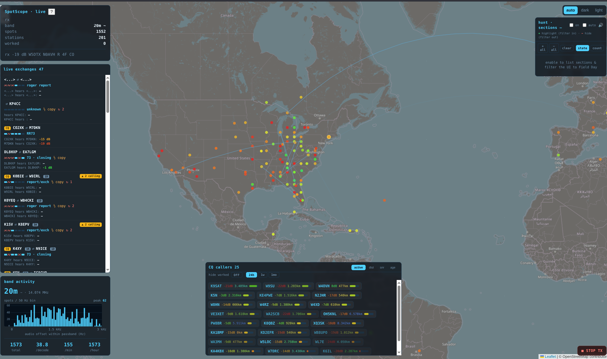
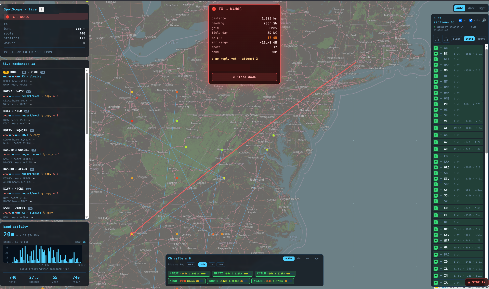
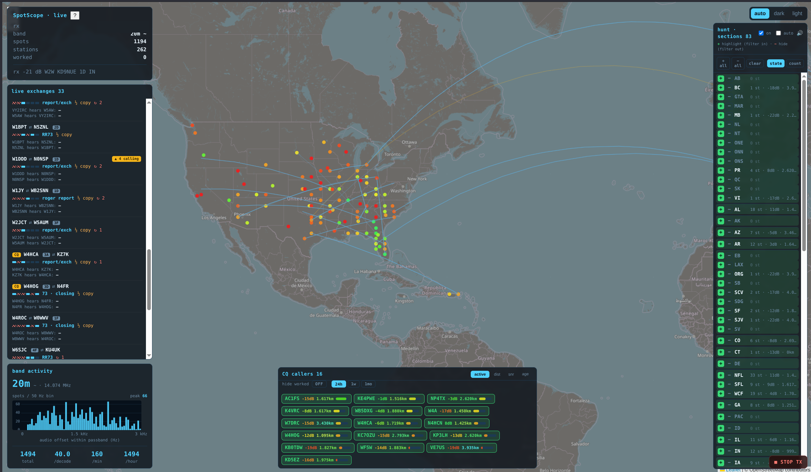

# SpotScope



A web dashboard for WSJT-X: it plots every FT8/FT4 decode on a live map and adds
panels to help you *work* people — who's calling CQ, which ARRL sections are on,
who's working whom, and one-click calling back into WSJT-X.

> ⚠️ **Vibe-coded.** Built fast, pair-programmed with an LLM. The protocol handling
> is careful and it's run against real on-air traffic, but it's a power-tool, not a
> polished product (read the [annoyances](#known-annoyances)). It gets real
> engineering effort *proportional to interest* — so make yours known: star the repo,
> open an issue.

## Screenshots

**QSO heads-up** — distance, heading, grid, FD class, SNR history and a great-circle
path to the station you're working; auto-hunt pauses so it won't chase someone else.



**Section hunting** — highlight/hide ARRL sections to filter the map and your hunt;
auto-hunt can queue the strongest CQ from highlighted sections.



## Features

- **Live map** of every decode (Maidenhead → lat/lon), great-circle paths.
- **CQ callers** ranked by activity (QSO rate + duty), sortable by dist/SNR/age,
  click-to-call. Hide already-worked (24h/1w/1mo).
- **Live exchanges** — who's working whom, tracked through the FT8 sequence, with
  half-copy and re-send detection. Click to zoom to the pair.
- **Section hunting** with optional **auto-hunt** (mutable audible cue).
- **QSO heads-up** with full station intel; warns if the station you're working
  starts answering someone else; celebrates a logged contact.
- **Band activity** histogram + spot rates. **Field Day aware** (class/section even
  without grids). **Inline help** on every panel (`?` / `ⓘ`).

## Stack

Bun + TypeScript backend (parses the WSJT-X `NetworkMessage` UDP protocol → SQLite →
WebSocket + REST), Leaflet/OSM frontend, no framework. Two-way: it sends commands
back to WSJT-X (answer CQ, target a station, highlight, halt) — you still press
Enable Tx.

For hams running WSJT-X who want more than the stock Band Activity window. Born for
**Field Day**, useful any FT8 evening.

## Quick start

```sh
docker compose up --build          # then open the link it prints (:8787)
# or, locally:
bun install && bun dev
```

Docker uses host networking so WSJT-X's two-way UDP works without NAT (Linux; see
`docker-compose.yml` for a bridge alternative).

**Point WSJT-X at it** — Settings → Reporting → UDP Server: `127.0.0.1`, port `2237`,
and enable **Accept UDP requests** (required for click-to-call/highlight/halt).

## Known annoyances

- **The UI updates out from under you** — every decode cycle re-renders/re-sorts
  panels, so lists reshuffle and a thing you were about to click can move. Not fixed.
- Sort/filter state is best-effort across refreshes; the map can get busy; activity
  scores and half-copy detection are heuristics.

## License

[AGPL-3.0-only](LICENSE) — use/run/modify freely; run a modified version as a network
service and you must share source. No closed-source repackaging.
